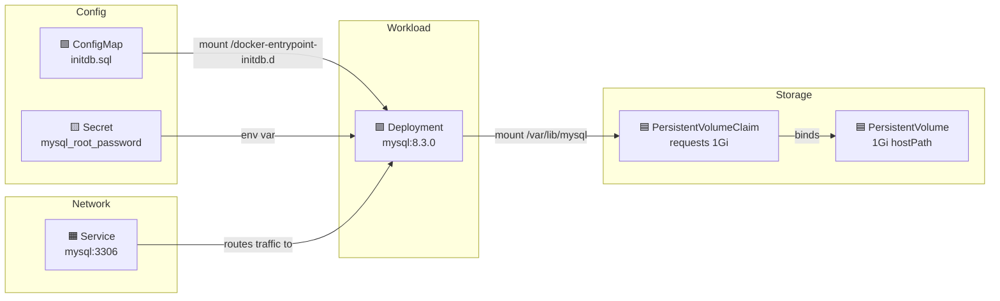

# Kubernetes Notes

## MySQL Deployment (`k8s/manifests/infrastructure/mysql.yaml`)

This single file contains 6 Kubernetes resources that work together:

### 1. Deployment — The MySQL workload

- Runs 1 replica of `mysql:8.3.0`
- Exposes port 3306 inside the pod
- Pulls root password from a Secret (`mysql-secrets`)
- Mounts two volumes:
  - `/var/lib/mysql` → PVC for data persistence (survives pod restarts)
  - `/docker-entrypoint-initdb.d` → ConfigMap with init SQL (runs on first startup)

### 2. Service — Network access

- Creates stable internal DNS name (`mysql`) for other pods to connect
- Routes TCP:3306 to pods with `app: mysql` label
- Type: ClusterIP (internal-only, not exposed outside the cluster)

### 3. Secret — Root password

- `mysql_root_password: bXlzcWw=` → base64 of `mysql`
- Referenced by Deployment via `secretKeyRef`
- Note: plain base64 in YAML is not secure for production — use a secrets manager

### 4. PersistentVolume (PV) — Physical storage

- Declares 1Gi at `/data/mysql` on the host node
- `hostPath` works for local dev clusters (Minikube, Kind) but not production
- `storageClassName: 'standard'` ties it to the PVC

### 5. PersistentVolumeClaim (PVC) — Storage request

- Requests 1Gi of `standard` storage with `ReadWriteOnce`
- Mounted by Deployment for `/var/lib/mysql`
- Abstraction layer: pod requests storage via PVC, K8s binds to matching PV

### 6. ConfigMap — Init SQL script

- Contains `initdb.sql` with `CREATE DATABASE` statements
- Mounted into `/docker-entrypoint-initdb.d` so MySQL auto-executes on first boot

### How they connect

> **Legend:**
> - 🟩 ConfigMap — init SQL script
> - 🟨 Secret — root password
> - 🟪 Deployment — the MySQL pod
> - 🟦 PV/PVC — persistent storage
> - 🟧 Service — network access

### Why init.sql is duplicated in docker/ and k8s/

- `docker/mysql/init.sql` — Used by Docker Compose (mounts the file directly)
- `k8s/.../mysql.yaml` ConfigMap — Used by Kubernetes (can't mount local files into pods)

Both target the same MySQL behavior: files in `/docker-entrypoint-initdb.d/` run on first container start. They're separate because Docker Compose and K8s use different mechanisms to get files into containers.
