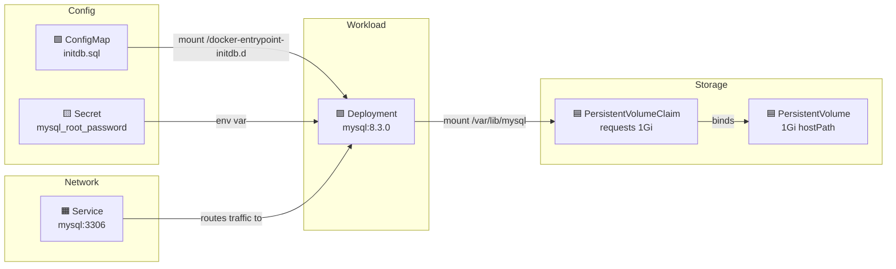

# Kubernetes Notes

## MySQL Deployment (`k8s/manifests/infrastructure/mysql.yaml`)

This single file contains 6 Kubernetes resources that work together:

### 1. Deployment — The MySQL workload

- Runs 1 replica of `mysql:8.3.0`
- Exposes port 3306 inside the pod
- Pulls root password from a Secret (`mysql-secrets`)
- Mounts two volumes:
  - `/var/lib/mysql` → PVC for data persistence (survives pod restarts)
  - `/docker-entrypoint-initdb.d` → ConfigMap with init SQL (runs on first startup)

### 2. Service — Network access

- Creates stable internal DNS name (`mysql`) for other pods to connect
- Routes TCP:3306 to pods with `app: mysql` label
- Type: ClusterIP (internal-only, not exposed outside the cluster)

### 3. Secret — Root password

- `mysql_root_password: bXlzcWw=` → base64 of `mysql`
- Referenced by Deployment via `secretKeyRef`
- Note: plain base64 in YAML is not secure for production — use a secrets manager

### 4. PersistentVolume (PV) — Physical storage

- Declares 1Gi at `/data/mysql` on the host node
- `hostPath` works for local dev clusters (Minikube, Kind) but not production
- `storageClassName: 'standard'` ties it to the PVC

### 5. PersistentVolumeClaim (PVC) — Storage request

- Requests 1Gi of `standard` storage with `ReadWriteOnce`
- Mounted by Deployment for `/var/lib/mysql`
- Abstraction layer: pod requests storage via PVC, K8s binds to matching PV

### 6. ConfigMap — Init SQL script

- Contains `initdb.sql` with `CREATE DATABASE` statements
- Mounted into `/docker-entrypoint-initdb.d` so MySQL auto-executes on first boot

### How they connect



> **Legend:**
> - 🟩 ConfigMap — init SQL script
> - 🟨 Secret — root password
> - 🟪 Deployment — the MySQL pod
> - 🟦 PV/PVC — persistent storage
> - 🟧 Service — network access

### Why init.sql is duplicated in docker/ and k8s/

- `docker/mysql/init.sql` — Used by Docker Compose (mounts the file directly)
- `k8s/.../mysql.yaml` ConfigMap — Used by Kubernetes (can't mount local files into pods)

Both target the same MySQL behavior: files in `/docker-entrypoint-initdb.d/` run on first container start. They're separate because Docker Compose and K8s use different mechanisms to get files into containers.


---

## Kind (Kubernetes IN Docker)

### What is Kind?

- A tool for running local Kubernetes clusters using **Docker containers** as nodes
- Each cluster "node" is actually a Docker container, not a VM
- Lightweight, fast to create/destroy, good for local dev and CI

### Alternatives to Kind

| Tool | Runs in | Multi-node | Best for |
|------|---------|-----------|----------|
| **Kind** | Docker containers | Yes | Local dev, CI pipelines |
| **Minikube** | VM or Docker | No (single) | Beginners, addons |
| **k3d** | Docker containers | Yes | Fast lightweight clusters |
| **MicroK8s** | Host (snap) | Yes | Linux users |
| **Docker Desktop** | VM | No | Zero-config quick tests |

### kind-config.yaml

```yaml
kind: Cluster
apiVersion: kind.x-k8s.io/v1alpha4
nodes:
  - role: control-plane
    extraPortMappings:
      - containerPort: 80
        hostPort: 80
        listenAddress: "127.0.0.1"
        protocol: TCP
```

- Single control-plane node
- Maps port 80 inside the cluster → port 80 on localhost
- Allows accessing services via `http://localhost` (with an Ingress controller)

### Image Loading: `docker pull` vs `kind load`

```
Docker Hub (remote)
       │
       │  docker pull
       ▼
Local Docker daemon (your machine)
       │
       │  kind load docker-image
       ▼
Kind cluster node (separate internal image store)
```

- **`docker pull`** — Downloads images from Docker Hub to your local Docker daemon
- **`kind load docker-image`** — Copies images from your local Docker daemon into the Kind cluster's nodes
- Kind nodes can't see your local Docker images directly (they run their own container runtime inside)
- Pre-loading avoids pods trying to pull from Docker Hub again from inside the cluster

### Using Your Own Images

The default image prefix is `saiupadhyayula007` (the instructor's Docker Hub). You can rename this to your own username or any prefix you want.

#### Changing the Image Prefix

The image name is defined in the root `pom.xml`:

```xml
<image>
  <name>${prefix}/new-${project.artifactId}</name>
</image>
```

Replace `${prefix}` with your Docker Hub username or any name (e.g., `myuser`, `mycompany`, `local`).

Then update these files to match:
- `k8s/kind/kind-load.sh` → replace the prefix in all image names
- `k8s/manifests/applications/*.yml` → replace `image: .../...` with your prefix

---

#### Option A: Local Build (No Docker Hub Push)

Build images locally and load them straight into Kind. Nothing gets pushed to any registry.

**Step 1: Build all backend services**

```bash
# From project root — builds all 5 services using Spring Boot Buildpacks
./mvnw spring-boot:build-image -DskipTests
```

**Step 2: Build the frontend**

```bash
cd frontend
docker build -t ${prefix}/frontend:latest .
cd ..
```

**Step 3: Verify images exist**

```bash
docker images "${prefix}/*"
```

**Step 4: Load into Kind (no pull needed)**

```bash
kind load docker-image -n microservices ${prefix}/new-api-gateway:latest
kind load docker-image -n microservices ${prefix}/new-product-service:latest
kind load docker-image -n microservices ${prefix}/new-order-service:latest
kind load docker-image -n microservices ${prefix}/new-inventory-service:latest
kind load docker-image -n microservices ${prefix}/new-notification-service:latest
kind load docker-image -n microservices ${prefix}/frontend:latest
```

**Step 5: Set `imagePullPolicy: Never` in all manifests**

In each `k8s/manifests/applications/*.yml`, add `imagePullPolicy: Never` under the container spec:

```yaml
containers:
  - name: api-gateway
    image: ${prefix}/new-api-gateway:latest
    imagePullPolicy: Never    # <-- use local image only
```

This tells Kubernetes to ONLY use images already loaded into the node and never try to pull from a registry.

**Rebuild a single service after code changes:**

```bash
# Rebuild only order-service
./mvnw spring-boot:build-image -DskipTests -pl order-service

# Reload into Kind
kind load docker-image -n microservices ${prefix}/new-order-service:latest

# Restart the deployment to pick up new image
kubectl rollout restart deployment order-service
```

**Troubleshooting:**

| Pod Status | Fix |
|------------|-----|
| `ErrImageNeverPull` | Image wasn't loaded into Kind. Run `kind load docker-image -n microservices <image>` |
| `ImagePullBackOff` | You forgot `imagePullPolicy: Never` in the manifest |

---

#### Option B: Push to Docker Hub

Build locally, push to your Docker Hub account, then let Kind pull from there.

**Step 1: Build images**

```bash
./mvnw spring-boot:build-image -DskipTests
cd frontend && docker build -t ${prefix}/frontend:latest . && cd ..
```

**Step 2: Push to Docker Hub**

```bash
docker login

docker push ${prefix}/new-api-gateway:latest
docker push ${prefix}/new-product-service:latest
docker push ${prefix}/new-order-service:latest
docker push ${prefix}/new-inventory-service:latest
docker push ${prefix}/new-notification-service:latest
docker push ${prefix}/frontend:latest
```

**Step 3: Pull and load into Kind**

```bash
docker pull ${prefix}/new-api-gateway:latest
docker pull ${prefix}/new-product-service:latest
docker pull ${prefix}/new-order-service:latest
docker pull ${prefix}/new-inventory-service:latest
docker pull ${prefix}/new-notification-service:latest
docker pull ${prefix}/frontend:latest

kind load docker-image -n microservices ${prefix}/new-api-gateway:latest
kind load docker-image -n microservices ${prefix}/new-product-service:latest
kind load docker-image -n microservices ${prefix}/new-order-service:latest
kind load docker-image -n microservices ${prefix}/new-inventory-service:latest
kind load docker-image -n microservices ${prefix}/new-notification-service:latest
kind load docker-image -n microservices ${prefix}/frontend:latest
```

**Step 4: Manifests — use `imagePullPolicy: IfNotPresent` (default)**

No need to set `imagePullPolicy: Never` since images exist in Docker Hub as a fallback. You can omit it or set:

```yaml
containers:
  - name: api-gateway
    image: ${prefix}/new-api-gateway:latest
    imagePullPolicy: IfNotPresent
```

> **Tip:** To enable auto-push during build (skip manual `docker push`), uncomment the `<docker><publishRegistry>` section in the root `pom.xml` and set `<publish>true</publish>`.

### Common Kind Commands

| Command | What it does |
|---------|-------------|
| `kind create cluster --config kind-config.yaml --name microservices` | Create cluster |
| `kind get clusters` | List clusters |
| `kind load docker-image IMAGE --name microservices` | Load image into cluster |
| `kind delete cluster --name microservices` | Delete cluster |
| `kubectl cluster-info --context kind-microservices` | Verify cluster connection |
| `kubectl get nodes` | Check node status |
| `kubectl get pods` | Check running pods |

### Deployment Order

1. Create Kind cluster
2. Load images into cluster
3. Install Ingress controller: `kubectl apply -f https://raw.githubusercontent.com/kubernetes/ingress-nginx/main/deploy/static/provider/kind/deploy.yaml`
4. Deploy infrastructure: `kubectl apply -f k8s/manifests/infra/`
5. Deploy applications: `kubectl apply -f k8s/manifests/applications/`
