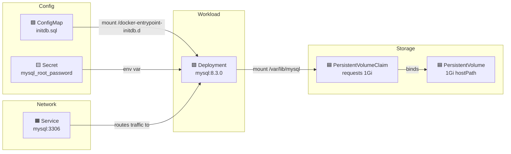

# Kubernetes Notes

## Table of Contents

1. [MySQL Deployment](#mysql-deployment-k8smanifestsinfrastructuremysqlyaml)
2. [Kind (Kubernetes IN Docker)](#kind-kubernetes-in-docker)
3. [Troubleshooting: Docker Desktop Containerd Image Store](#troubleshooting-docker-desktop-containerd-image-store)
4. [Namespace Organization](#namespace-organization)
5. [Applying Namespace Changes](#applying-namespace-changes)
6. [Port-Forwarding Reference](#port-forwarding-reference)
7. [Troubleshooting: Rebuilding & Reloading Images in Kind](#troubleshooting-rebuilding--reloading-images-in-kind)
8. [Troubleshooting: 503 Service Unavailable (Circuit Breaker)](#troubleshooting-503-service-unavailable-circuit-breaker)
9. [CI/CD with GitHub Actions + ArgoCD](#cicd-with-github-actions--argocd)

---

## MySQL Deployment (`k8s/manifests/infrastructure/mysql.yaml`)

This single file contains 6 Kubernetes resources that work together:

### 1. Deployment — The MySQL workload

- Runs 1 replica of `mysql:8.3.0`
- Exposes port 3306 inside the pod
- Pulls root password from a Secret (`mysql-secrets`)
- Mounts two volumes:
  - `/var/lib/mysql` → PVC for data persistence (survives pod restarts)
  - `/docker-entrypoint-initdb.d` → ConfigMap with init SQL (runs on first startup)

### 2. Service — Network access

- Creates stable internal DNS name (`mysql`) for other pods to connect
- Routes TCP:3306 to pods with `app: mysql` label
- Type: ClusterIP (internal-only, not exposed outside the cluster)

### 3. Secret — Root password

- `mysql_root_password: bXlzcWw=` → base64 of `mysql`
- Referenced by Deployment via `secretKeyRef`
- Note: plain base64 in YAML is not secure for production — use a secrets manager

### 4. PersistentVolume (PV) — Physical storage

- Declares 1Gi at `/data/mysql` on the host node
- `hostPath` works for local dev clusters (Minikube, Kind) but not production
- `storageClassName: 'standard'` ties it to the PVC

### 5. PersistentVolumeClaim (PVC) — Storage request

- Requests 1Gi of `standard` storage with `ReadWriteOnce`
- Mounted by Deployment for `/var/lib/mysql`
- Abstraction layer: pod requests storage via PVC, K8s binds to matching PV

### 6. ConfigMap — Init SQL script

- Contains `initdb.sql` with `CREATE DATABASE` statements
- Mounted into `/docker-entrypoint-initdb.d` so MySQL auto-executes on first boot

### How they connect



> **Legend:**
> - 🟩 ConfigMap — init SQL script
> - 🟨 Secret — root password
> - 🟪 Deployment — the MySQL pod
> - 🟦 PV/PVC — persistent storage
> - 🟧 Service — network access

### Why init.sql is duplicated in docker/ and k8s/

- `docker/mysql/init.sql` — Used by Docker Compose (mounts the file directly)
- `k8s/.../mysql.yaml` ConfigMap — Used by Kubernetes (can't mount local files into pods)

Both target the same MySQL behavior: files in `/docker-entrypoint-initdb.d/` run on first container start. They're separate because Docker Compose and K8s use different mechanisms to get files into containers.

[↑ Back to top](#table-of-contents)

---

## Kind (Kubernetes IN Docker)

### What is Kind?

- A tool for running local Kubernetes clusters using **Docker containers** as nodes
- Each cluster "node" is actually a Docker container, not a VM
- Lightweight, fast to create/destroy, good for local dev and CI

### Alternatives to Kind

| Tool | Runs in | Multi-node | Best for |
|------|---------|-----------|----------|
| **Kind** | Docker containers | Yes | Local dev, CI pipelines |
| **Minikube** | VM or Docker | No (single) | Beginners, addons |
| **k3d** | Docker containers | Yes | Fast lightweight clusters |
| **MicroK8s** | Host (snap) | Yes | Linux users |
| **Docker Desktop** | VM | No | Zero-config quick tests |

### kind-config.yaml

```yaml
kind: Cluster
apiVersion: kind.x-k8s.io/v1alpha4
nodes:
  - role: control-plane
    extraPortMappings:
      - containerPort: 80
        hostPort: 80
        listenAddress: "127.0.0.1"
        protocol: TCP
```

- Single control-plane node
- Maps port 80 inside the cluster → port 80 on localhost
- Allows accessing services via `http://localhost` (with an Ingress controller)

### Image Loading: `docker pull` vs `kind load`

```
Docker Hub (remote)
       │
       │  docker pull
       ▼
Local Docker daemon (your machine)
       │
       │  kind load docker-image
       ▼
Kind cluster node (separate internal image store)
```

- **`docker pull`** — Downloads images from Docker Hub to your local Docker daemon
- **`kind load docker-image`** — Copies images from your local Docker daemon into the Kind cluster's nodes
- Kind nodes can't see your local Docker images directly (they run their own container runtime inside)
- Pre-loading avoids pods trying to pull from Docker Hub again from inside the cluster

### Using Your Own Images

The default image prefix is `saiupadhyayula007` (the instructor's Docker Hub). You can rename this to your own username or any prefix you want.

#### Changing the Image Prefix

The image name is defined in the root `pom.xml`:

```xml
<image>
  <name>${prefix}/new-${project.artifactId}</name>
</image>
```

Replace `${prefix}` with your Docker Hub username or any name (e.g., `myuser`, `mycompany`, `local`).

Then update these files to match:
- `k8s/kind/kind-load.sh` → replace the prefix in all image names
- `k8s/manifests/applications/*.yml` → replace `image: .../...` with your prefix

---

#### Option A: Local Build (No Docker Hub Push)

Build images locally and load them straight into Kind. Nothing gets pushed to any registry.

**Step 1: Package all services**

```bash
# From project root — compiles and packages all JARs
./mvnw package -DskipTests
```

**Step 2: Build Docker images**

```bash
docker build -t ${prefix}/new-api-gateway:latest ./api-gateway
docker build -t ${prefix}/new-product-service:latest ./product-service
docker build -t ${prefix}/new-order-service:latest ./order-service
docker build -t ${prefix}/new-inventory-service:latest ./inventory-service
docker build -t ${prefix}/new-notification-service:latest ./notification-service
```

**Step 3: Build the frontend**

```bash
cd frontend
docker build -t ${prefix}/frontend:latest .
cd ..
```

**Step 4: Verify images exist**

```bash
docker images "${prefix}/*"
```

**Step 5: Load into Kind (no pull needed)**

```bash
kind load docker-image -n microservices ${prefix}/new-api-gateway:latest
kind load docker-image -n microservices ${prefix}/new-product-service:latest
kind load docker-image -n microservices ${prefix}/new-order-service:latest
kind load docker-image -n microservices ${prefix}/new-inventory-service:latest
kind load docker-image -n microservices ${prefix}/new-notification-service:latest
kind load docker-image -n microservices ${prefix}/frontend:latest
```

**Step 6: Set `imagePullPolicy: Never` in all manifests**

In each `k8s/manifests/applications/*.yml`, add `imagePullPolicy: Never` under the container spec:

```yaml
containers:
  - name: api-gateway
    image: ${prefix}/new-api-gateway:latest
    imagePullPolicy: Never    # <-- use local image only
```

This tells Kubernetes to ONLY use images already loaded into the node and never try to pull from a registry.

**Rebuild a single service after code changes:**

```bash
# Rebuild only order-service
./mvnw package -DskipTests -pl order-service
docker build -t ${prefix}/new-order-service:latest ./order-service

# Reload into Kind
kind load docker-image -n microservices ${prefix}/new-order-service:latest

# Restart the deployment to pick up new image
kubectl rollout restart deployment order-service
```

> **Alternative: Spring Boot Buildpacks**
> Instead of Dockerfiles, you can use `./mvnw spring-boot:build-image -DskipTests` which uses Cloud Native Buildpacks. However, this requires pulling a builder image (`paketobuildpacks/builder-jammy-tiny`) which may fail on some Docker Desktop versions with a 400 "Bad Request" error. The Dockerfile approach above is more reliable.

**Troubleshooting:**

| Pod Status | Fix |
|------------|-----|
| `ErrImageNeverPull` | Image wasn't loaded into Kind. Run `kind load docker-image -n microservices <image>` |
| `ImagePullBackOff` | You forgot `imagePullPolicy: Never` in the manifest |

---

#### Option B: Push to Docker Hub

Build locally, push to your Docker Hub account, then let Kind pull from there.

> **Why push to Docker Hub even for Kind?**
> In practice, `imagePullPolicy: Never` with `kind load docker-image` can be unreliable — pods still get `ImagePullBackOff` or `ErrImagePull` due to:
> - Image digest/tag mismatches between local Docker and Kind's containerd runtime
> - Kubernetes defaulting to pull for `:latest` tags despite the policy
> - Stale ReplicaSets retaining old pod specs after manifest updates
>
> Pushing to Docker Hub and using `imagePullPolicy: IfNotPresent` is the more reliable approach. Kind will still pull once and cache the image, so subsequent pod restarts are fast.

**Step 1: Build images**

```bash
./mvnw spring-boot:build-image -DskipTests
cd frontend && docker build -t ${prefix}/frontend:latest . && cd ..
```

**Step 2: Log in to Docker Hub**

```bash
docker login
# Enter your Docker Hub username and password (or access token)
```

If your images were built with a different prefix (e.g., `myuser`), re-tag them with your actual Docker Hub username:

```bash
docker tag myuser/new-api-gateway:latest yourdockerhubuser/new-api-gateway:latest
docker tag myuser/new-product-service:latest yourdockerhubuser/new-product-service:latest
docker tag myuser/new-order-service:latest yourdockerhubuser/new-order-service:latest
docker tag myuser/new-inventory-service:latest yourdockerhubuser/new-inventory-service:latest
docker tag myuser/new-notification-service:latest yourdockerhubuser/new-notification-service:latest
docker tag myuser/frontend:latest yourdockerhubuser/frontend:latest
```

**Step 3: Push to Docker Hub**

```bash
docker push yourdockerhubuser/new-api-gateway:latest
docker push yourdockerhubuser/new-product-service:latest
docker push yourdockerhubuser/new-order-service:latest
docker push yourdockerhubuser/new-inventory-service:latest
docker push yourdockerhubuser/new-notification-service:latest
docker push yourdockerhubuser/frontend:latest
```

**Step 4: Update K8s manifests**

Change image names and pull policy in all `k8s/manifests/applications/*.yml`:

```yaml
containers:
  - name: api-gateway
    image: yourdockerhubuser/new-api-gateway:latest
    imagePullPolicy: IfNotPresent
```

**Step 5: Re-deploy**

```bash
kubectl apply -f k8s/manifests/applications/
kubectl rollout restart deployment api-gateway product-service order-service inventory-service notification-service frontend
```

> **Tip:** To enable auto-push during build (skip manual `docker push`), uncomment the `<docker><publishRegistry>` section in the root `pom.xml` and set `<publish>true</publish>`.

### Common Kind Commands

| Command | What it does |
|---------|-------------|
| `kind create cluster --config kind-config.yaml --name microservices` | Create cluster |
| `kind get clusters` | List clusters |
| `kind load docker-image IMAGE --name microservices` | Load image into cluster |
| `kind delete cluster --name microservices` | Delete cluster |
| `kubectl cluster-info --context kind-microservices` | Verify cluster connection |
| `kubectl get nodes` | Check node status |
| `kubectl get pods` | Check running pods |

### Deployment Order

1. Create Kind cluster
2. Load images into cluster
3. Verify images loaded:
   ```bash
   # List all images inside the Kind node
   docker exec microservices-control-plane crictl images

   # Filter to application images
   docker exec microservices-control-plane crictl images | grep myuser

   # Check cluster health
   kubectl get nodes
   ```
4. Install Ingress controller: `kubectl apply -f https://raw.githubusercontent.com/kubernetes/ingress-nginx/main/deploy/static/provider/kind/deploy.yaml`
5. Deploy infrastructure: `kubectl apply -f k8s/manifests/infra/`
6. Deploy applications: `kubectl apply -f k8s/manifests/applications/`

[↑ Back to top](#table-of-contents)

---

## Troubleshooting: Docker Desktop Containerd Image Store

### Problem

`kind load docker-image` fails with errors like:

```
ERROR: failed to load image: command "docker exec --privileged -i microservices-control-plane ctr ..." 
failed with error: exit status 1
Command Output: ctr: content digest sha256:...: not found
```

### Cause

Docker Desktop has the **containerd image store** enabled (default in newer versions). This changes how images are stored internally, and `kind load` can't resolve the multi-platform manifest digests.

### Fix

1. **Docker Desktop → Settings → General → uncheck "Use containerd for pulling and storing images" → Apply & Restart**
2. Recreate the Kind cluster (Docker restart wipes containers):
   ```bash
   kind create cluster --name microservices --config kind-config.yaml
   ```
3. Re-run `./kind-load.sh` — images will load cleanly

[↑ Back to top](#table-of-contents)

---

## Namespace Organization

### Why Use Namespaces?

- Logical separation of concerns (infra vs apps vs monitoring)
- Ability to apply resource quotas and network policies per group
- Cleaner `kubectl get pods` output (filter by namespace)
- Closer to production best practices

### Namespace Layout

| Namespace | Resources |
|-----------|-----------|
| `microservices-infra` | mysql, mongodb, kafka (broker), zookeeper, keycloak, keycloak-mysql, schema-registry, kafka-ui, grafana, prometheus, tempo, loki |
| `microservices-apps` | product-service, order-service, inventory-service, notification-service, api-gateway, frontend |

### Steps to Migrate

**1. Create the namespaces (must exist before deploying into them):**

```bash
kubectl create namespace microservices-infra
kubectl create namespace microservices-apps
```


**2. Delete existing resources from default namespace:**

```bash
kubectl delete -f k8s/manifests/infra/
kubectl delete -f k8s/manifests/applications/
```


**4. Update cross-namespace service references in ConfigMaps:**

When services are in different namespaces, use the fully qualified DNS name:

```
<service-name>.<namespace>.svc.cluster.local
```

| Old (default namespace) | New (with namespaces) |
|-------------------------|----------------------|
| `mysql` | `mysql.microservices-infra.svc.cluster.local` |
| `mongodb` | `mongodb.microservices-infra.svc.cluster.local` |
| `broker:9092` | `broker.microservices-infra.svc.cluster.local:9092` |
| `keycloak:8080` | `keycloak.microservices-infra.svc.cluster.local:8080` |
| `schema-registry:8081` | `schema-registry.microservices-infra.svc.cluster.local:8081` |
| `loki:3100` | `loki.monitoring.svc.cluster.local:3100` |
| `tempo:4317` | `tempo.monitoring.svc.cluster.local:4317` |
| `product-service:8080` | `product-service.microservices-apps.svc.cluster.local:8080` |
| `order-service:8081` | `order-service.microservices-apps.svc.cluster.local:8081` |
| `inventory-service:8082` | `inventory-service.microservices-apps.svc.cluster.local:8082` |

> **Note:** Services within the SAME namespace can still use short names (e.g., `product-service` from `api-gateway` since both are in `microservices-apps`).

**5. Re-deploy:**

```bash
kubectl apply -f k8s/manifests/infra/ -n microservices-infra
kubectl apply -f k8s/manifests/applications/ -n microservices-apps
```

**6. Verify:**

```bash
kubectl get pods -n microservices-infra
kubectl get pods -n microservices-apps
```

### Useful Namespace Commands

| Command | What it does |
|---------|-------------|
| `kubectl get namespaces` | List all namespaces |
| `kubectl get pods -n <namespace>` | List pods in a specific namespace |
| `kubectl get all -n <namespace>` | List all resources in a namespace |
| `kubectl get pods --all-namespaces` | List pods across all namespaces |
| `kubectl config set-context --current --namespace=<namespace>` | Set default namespace for kubectl |

[↑ Back to top](#table-of-contents)

---

## Applying Namespace Changes

### Deploy Commands

```bash
# 1. Create namespaces
kubectl create namespace microservices-infra
kubectl create namespace microservices-apps

# 2. Delete old resources from default namespace
kubectl delete -f k8s/manifests/infra/
kubectl delete -f k8s/manifests/applications/

# 3. Deploy infrastructure to microservices-infra
kubectl apply -f k8s/manifests/infra/ -n microservices-infra

# 4. Deploy applications to microservices-apps
kubectl apply -f k8s/manifests/applications/ -n microservices-apps
```

### Using `-n` Flag vs Hardcoding `namespace:` in YAML

- `kubectl apply -f <file> -n <namespace>` assigns namespace at deploy time — no YAML edits needed
- If a manifest already has `namespace:` in metadata, the file wins over the `-n` flag
- Best approach: don't hardcode `namespace:` in YAML, use `-n` flag for flexibility

### Files That Need Cross-Namespace URL Updates

These files contain `.default.svc.cluster.local` references that must be changed manually:

| File | What to change |
|------|---------------|
| `applications/common-config.yml` | ✅ Done — loki→microservices-infra, tempo→microservices-infra, broker→microservices-infra, app services→short names |
| `applications/api-gateway.yml` | ✅ Done — keycloak→microservices-infra |
| `applications/inventory-service.yml` | `mysql.default` → `mysql.microservices-infra` |
| `applications/order-service.yml` | `mysql.default` → `mysql.microservices-infra`, `schema-registry.default` → `schema-registry.microservices-infra` |
| `applications/product-service.yml` | `mongodb.default` → `mongodb.microservices-infra` |
| `applications/notification-service.yml` | `schema-registry.default` → `schema-registry.microservices-infra` |
| `infra/grafana.yml` | `prometheus.default` → `prometheus.microservices-infra`, `tempo.default` → `tempo.microservices-infra`, `loki.default` → `loki.microservices-infra` |
| `infra/prometheus.yml` | All app targets: `.default` → `.microservices-apps` |

[↑ Back to top](#table-of-contents)

---

## Port-Forwarding Reference

### Applications (`microservices-apps`)

| Service | Command | Local URL |
|---------|---------|-----------|
| API Gateway | `kubectl port-forward -n microservices-apps svc/api-gateway 9000:9000` | `localhost:9000` |
| Frontend | `kubectl port-forward -n microservices-apps svc/frontend 4200:80` | `localhost:4200` |
| Product Service | `kubectl port-forward -n microservices-apps svc/product-service 8080:8080` | `localhost:8080` |
| Order Service | `kubectl port-forward -n microservices-apps svc/order-service 8081:8081` | `localhost:8081` |
| Inventory Service | `kubectl port-forward -n microservices-apps svc/inventory-service 8082:8082` | `localhost:8082` |
| Notification Service | `kubectl port-forward -n microservices-apps svc/notification-service 8083:8083` | `localhost:8083` |

### Infrastructure (`microservices-infra`)

| Service | Command | Local URL |
|---------|---------|-----------|
| Grafana | `kubectl port-forward -n microservices-infra svc/grafana 3000:3000` | `localhost:3000` |
| Prometheus | `kubectl port-forward -n microservices-infra svc/prometheus 9090:9090` | `localhost:9090` |
| Keycloak | `kubectl port-forward -n microservices-infra svc/keycloak 8181:8080` | `localhost:8181` |
| Kafka UI | `kubectl port-forward -n microservices-infra svc/kafka-ui 8989:8080` | `localhost:8989` |
| MongoDB | `kubectl port-forward -n microservices-infra svc/mongodb 27017:27017` | `localhost:27017` |
| MySQL | `kubectl port-forward -n microservices-infra svc/mysql 3306:3306` | `localhost:3306` |
| Tempo | `kubectl port-forward -n microservices-infra svc/tempo 3200:3200` | `localhost:3200` |
| Schema Registry | `kubectl port-forward -n microservices-infra svc/schema-registry 8085:8081` | `localhost:8085` |

### ArgoCD (`argocd`)

| Service | Command | Local URL |
|---------|---------|-----------|
| ArgoCD Server | `kubectl port-forward -n argocd svc/argocd-server 8443:443` | `https://localhost:8443` |

> **Note:** Keycloak uses local port `8181` and Kafka UI uses `8989` to avoid clashing with product-service on `8080`.

> **Why no Loki port-forward?** Grafana connects to Loki internally within the cluster (`loki.microservices-infra.svc.cluster.local:3100`). You only need to port-forward Grafana to view logs. A Loki port-forward is only needed if you want to query Loki directly from your machine (e.g., with `curl` or `logcli`).

### All-in-One Background Script

```bash
# Start all useful port-forwards in background
kubectl port-forward -n microservices-apps svc/api-gateway 9000:9000 &
kubectl port-forward -n microservices-apps svc/frontend 4200:80 &
kubectl port-forward -n microservices-infra svc/grafana 3000:3000 &
kubectl port-forward -n microservices-infra svc/keycloak 8181:8080 &
kubectl port-forward -n microservices-infra svc/kafka-ui 8989:8080 &
kubectl port-forward -n microservices-infra svc/prometheus 9090:9090 &
kubectl port-forward -n argocd svc/argocd-server 8443:443 &

# Stop all port-forwards
kill $(jobs -p)
```

### Testing Endpoints

Through the API Gateway (`localhost:9000`):

| URL | What it does |
|-----|-------------|
| `localhost:9000/swagger-ui.html` | Swagger UI (all service APIs) |
| `localhost:9000/actuator/health` | API Gateway health check |
| `localhost:9000/api/product` | Product Service |
| `localhost:9000/api/order` | Order Service |
| `localhost:9000/api/inventory` | Inventory Service |

### Quick Health Check (all services at once, no port-forward needed)

```bash
kubectl exec -n microservices-apps deployment/api-gateway -- sh -c '
  echo "API Gateway: $(curl -s http://localhost:9000/actuator/health | grep -o "UP\|DOWN")";
  echo "Product:     $(curl -s http://product-service:8080/actuator/health | grep -o "UP\|DOWN")";
  echo "Order:       $(curl -s http://order-service:8081/actuator/health | grep -o "UP\|DOWN")";
  echo "Inventory:   $(curl -s http://inventory-service:8082/actuator/health | grep -o "UP\|DOWN")"
'
```

[↑ Back to top](#table-of-contents)

---

## Troubleshooting: Rebuilding & Reloading Images in Kind

### Problem: `kind load` says "already present on all nodes" (stale image)

When you rebuild an image with the same `latest` tag, Kind compares by image ID (SHA). If the old image is still cached on the node, it skips the load.

### Fix: Force reload with `latest` tag

```bash
# 1. Remove the old image from Kind's node
docker exec microservices-control-plane crictl rmi <image-name>:latest

# 2. Rebuild the image
mvn spring-boot:build-image -pl <module> -DskipTests -Dspring-boot.build-image.imageName=<image-name>:latest

# 3. Load the new image into Kind
kind load docker-image <image-name>:latest --name microservices

# 4. Delete the pod to force restart with new image
kubectl delete pod -n microservices-apps -l app=<app-name>
```

### Example: Rebuilding api-gateway

```bash
docker exec microservices-control-plane crictl rmi kyowanghwe99/new-api-gateway:latest
mvn spring-boot:build-image -pl api-gateway -DskipTests -Dspring-boot.build-image.imageName=kyowanghwe99/new-api-gateway:latest
kind load docker-image kyowanghwe99/new-api-gateway:latest --name microservices
kubectl delete pod -n microservices-apps -l app=api-gateway
```

### Verify the new image is running

```bash
# Check the image SHA — should be different from before
kubectl get pods -n microservices-apps -l app=api-gateway -o jsonpath='{.items[0].status.containerStatuses[0].imageID}'
```

### Key points

- `kind load` compares by image ID, not tag name — same tag with old SHA = skipped
- `crictl rmi` removes the cached image from Kind's containerd runtime
- Always verify with `imageID` after restart to confirm the new image is active
- Alternative: use versioned tags (`v2`, `v3`) instead of `latest` to avoid caching issues entirely

[↑ Back to top](#table-of-contents)

---

## Troubleshooting: 503 Service Unavailable (Circuit Breaker)

### Symptom

Swagger UI or API calls through the gateway return 503 with body: "Service Unavailable, please try again later"

### Cause

The API Gateway's circuit breaker tripped because it can't reach the target service. Common reasons:
- **Wrong namespace in service URL** — e.g., `mongodb.default.svc.cluster.local` when MongoDB is in `microservices-infra`
- Service pod is running but can't connect to its database → fails to serve requests
- Pod shows `1/1 Running` but the app inside is broken (check logs)

### Fix

1. Check the ConfigMap URLs match actual service namespaces
2. Check target service logs: `kubectl logs -n <namespace> deployment/<service> --tail=50`
3. Fix the ConfigMap, re-apply, and restart the pod

[↑ Back to top](#table-of-contents)

---

## CI/CD with GitHub Actions + ArgoCD

### Architecture (2-Branch Approach)

```
master (your code) ──► CI builds image ──► CI updates manifests on deploy branch
                                                        │
                                              ArgoCD watches deploy branch
                                                        │
                                              Deploys to K8s cluster
```

- **`master`** — source code only. You push here. Clean commit history.
- **`deploy`** — K8s manifests with image tags. CI updates this automatically. You never touch it.

```
┌─────────────────────────────────────────────────────────┐
│ GitHub                                                   │
│                                                          │
│  master branch (code only)                               │
│       │                                                  │
│       │ push code                                        │
│       ▼                                                  │
│  GitHub Actions                                          │
│       │                                                  │
│       ├── push image ──► Docker Hub                      │
│       │                                                  │
│       └── update manifests ──► deploy branch             │
│                                                          │
└─────────────────────────────────────────────────────────┘
                    │
                    │ ArgoCD watches deploy branch
                    ▼
┌─────────────────────────────────────────────────────────┐
│ Kind cluster                                             │
│                                                          │
│  ArgoCD ──► detects new image tag ──► deploys to K8s     │
└─────────────────────────────────────────────────────────┘
```

### Flow

1. Push code to `master` branch (e.g., change in `order-service/`)
2. GitHub Actions detects which service changed (path filters)
3. Builds Docker image with commit SHA tag
4. Pushes image to Docker Hub
5. Checks out `deploy` branch, updates `k8s/manifests/applications/<service>.yml` with new image tag
6. Pushes manifest change to `deploy` branch (not master)
7. ArgoCD (in Kind cluster) detects the manifest change on `deploy` branch
8. ArgoCD pulls new image from Docker Hub and deploys to K8s

> **Why 2 branches?** Keeps `master` history clean (no "Update image tags" noise from CI). The `deploy` branch is managed entirely by CI — you never push to it manually.

### Mono-repo vs Two-repo

| Approach | Pros | Cons |
|----------|------|------|
| **Mono-repo, 2-branch** (what we use) | Simple, clean master history, one repo | deploy branch is auto-managed |
| **Two repos** (production standard) | Clean separation, PR-based deploy approval | More repos to manage |

### Avoiding Infinite Loops (Mono-repo)

The workflow triggers ONLY on source code paths:

```yaml
on:
  push:
    paths:
      - 'product-service/**'
      - 'order-service/**'
      - 'inventory-service/**'
      - 'notification-service/**'
      - 'api-gateway/**'
      - 'frontend/**'
      - 'pom.xml'
```

`k8s/manifests/**` is NOT in the list → CI commits to manifests don't re-trigger the workflow → no loop.

### GitHub Secrets Required

| Secret | Value |
|--------|-------|
| `DOCKER_USERNAME` | Docker Hub username |
| `DOCKER_PASSWORD` | Docker Hub password or access token |

### ArgoCD Setup on Kind

```bash
# Install ArgoCD
kubectl create namespace argocd
kubectl apply -n argocd -f https://raw.githubusercontent.com/argoproj/argo-cd/stable/manifests/install.yaml

# Wait for ready
kubectl wait --for=condition=ready pod -l app.kubernetes.io/name=argocd-server -n argocd --timeout=300s

# Get admin password
kubectl -n argocd get secret argocd-initial-admin-secret -o jsonpath="{.data.password}" | base64 -d

# Port-forward UI
kubectl port-forward svc/argocd-server -n argocd 8443:443
# Access: https://localhost:8443 (admin / <password from above>)

# Apply ArgoCD applications
kubectl apply -f k8s/argocd/apps-application.yml
kubectl apply -f k8s/argocd/infra-application.yml
```

### ArgoCD Application Config

Points to subfolders in the same repo:

```yaml
spec:
  source:
    repoURL: https://github.com/kyowanghwe99/spring-boot-3-microservices-course.git
    targetRevision: main
    path: k8s/manifests/applications  # or k8s/manifests/infra
  syncPolicy:
    automated:
      prune: true      # removes resources deleted from Git
      selfHeal: true   # reverts manual kubectl changes
```

### Important: imagePullPolicy

With ArgoCD pulling from Docker Hub, use `imagePullPolicy: Always` in manifests (not `IfNotPresent`). ArgoCD manages deployments — no more `kind load docker-image`.

[↑ Back to top](#table-of-contents)
